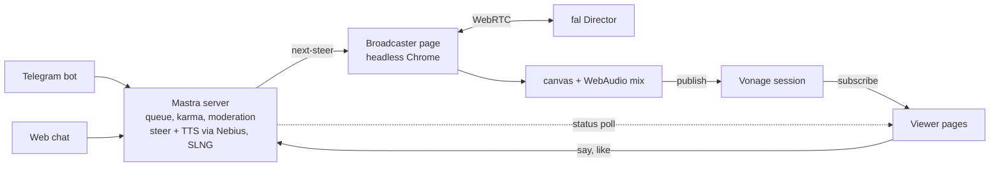

# polsTV


Twitch meets community AI channel, polsTV. 

Viewers send a one-line idea
from the web page or by texting the Telegram bot [@timesquarescreenbot](https://t.me/timesquarescreenbot);
the live shot morphs into each idea without a cut. Tap the screen to like a scene — likes are karma for
whoever prompted it. Built in one weekend at HackBarna AI Summit 26 (Barcelona, 19–20 Sep 2026).

Who it's for: Useful for digital first streamings like Twitch and Youtube to keep audiences interactive, bars and pubs as background and a draw for younger crowds, and some retail environments, gyms, and waiting areas.

## How it works



The Mastra server never talks to Director. It holds the queue, karma and moderation state, writes
steering prompts and the lines the channel's voice speaks, and exposes them at
`GET /b/:secret/next-steer`. The broadcaster page — a browser tab, run headless in Chrome — is the
only thing with a WebRTC connection to Director; it draws the incoming video to a canvas, mixes the
SLNG clips in with WebAudio one at a time, and republishes the mix into a Vonage session that every
viewer subscribes to.

### Life of an idea

1. A viewer sends an idea (web `POST /say`, or the Telegram `submit_idea` tool). It's moderated on
   Nebius before anything else happens (~0.6–1.4 s); rejected ideas stop here with a reason.
2. Once the scene on air has held the screen for at least 10 s and no steer is in flight, the
   broadcaster's next poll of `/b/:secret/next-steer` (every 3 s) makes the server pick the
   highest-karma, then oldest, queued idea.
3. The server writes a steering prompt from it on Nebius (~6–7 s) and, in parallel, checks whether
   the idea reads as a request for an ad (`isAdIdea` in `showrunner.ts`); if it does, it writes and
   synthesises an ad read (the write is time-boxed at 8 s) — every other idea gets no clip at all.
4. The broadcaster sends `{type: "prompt", prompt, prompt_version}` to the open Director session (or
   `configure`s a new one) and, when the steer carries a clip, holds it for `AD_CLIP_DELAY_MS`
   (17 s) so it lands on its own scene instead of the one still on screen.
5. Director confirms `prompt_applied` ~7–8 s after the send. The broadcaster reports that to
   `POST /b/:secret/steer-result`; the server makes the idea the scene on air and DMs the Telegram
   submitter "You're on air now!"
6. The new frames actually reach the canvas, get republished into Vonage, and land on every viewer's
   screen ~17–20 s after the original send. A steer whose idea asked for an ad has its ad read start
   once that new scene lands; every other steer plays in silence.

### The voice

The channel's voice only speaks for an ad. When a viewer's idea reads as a request to create or
broadcast an ad — `isAdIdea()` in `showrunner.ts`, a keyword check covering English, Catalan and
Spanish — the same ad-writing agent behind the karma-gated pitch (below) writes a high-energy
infomercial read for it: a hook, the invented product named and revealed, one absurdly specific
benefit, and a tagline, opening "A word from Timba." SLNG's `slng/fish/tts:s2.1-pro` gets a leading
`[excited]` tone marker in the text, a silent control tag it does not read aloud (verified live by
transcribing a marked clip back). The write runs in parallel with the steer-writing call,
time-boxed at 8 seconds, and the steer simply airs silent — no clip at all — on a non-ad idea, a
timeout, a write failure, an empty read, or a TTS failure. The written line is capped at 25 words in
code, since the clip has to finish before the next steer arrives.

The same voice is also the karma reward. At 3 karma a viewer unlocks the pitch: they send a brief
of up to 140 characters ("sell my lemonade stand, aggressively") and the channel reads the same
kind of ad for it over whatever is on air, opening "A word from Timba." The brief and the nickname
go through their own moderation rubric first — no real brands, people, prices, claims or URLs — and
the written read is capped at the same 25 words with anything URL-like stripped out. One pitch is
on air or pending at a time, one per viewer every three minutes, and a pitch nobody collects within
60 seconds is dropped and the viewer told. The broadcaster plays spoken clips strictly one after
another, so a pitch never talks over a steer's ad read.

Every ad read is hard-stopped at 10 seconds (`AD_MAX_MS`, `broadcaster.html`), cutting a long read
rather than letting it run — the 25-word cap keeps this rare. The moment a clip actually starts
playing, the broadcaster reports it to the server (`POST /b/:secret/clip-started`), which puts an
"AD" banner on screen over the picture (`ad-banner.ts`, `index.html`) for the same 10 seconds, so
the voice and the banner always go quiet together.

### Why Director, not a text-to-video call

A "simple text-to-video call" would generate an independent clip per idea and queue them: a hard cut
every time one airs, with nothing carried between clips. polsTV instead opens one Director session
per broadcaster (`openDirectorSession` in `broadcaster.html`) and steers it while it keeps running —
`configure` once with `memory: 12` (the last 12 prior segment prompts kept as context), then `prompt`
messages with a strictly increasing `prompt_version` for every later steer. Because Director models
continuity itself rather than the prompt re-describing it, the subject and props survive a steer
without being spelled out again: the measured spike carried a capybara and a rubber duck from a
kitchen, through a door, into an arcade on a single steer (`spike/frames/contact.jpg`,
`docs/cards/director.md`). A queue of independent clips cannot do that — every clip starts from
nothing.

### Why the broadcaster is a browser tab

Director's session — and the `session.send(...)` call that steers it — lives on a browser
`RTCPeerConnection`. Node has no `RTCPeerConnection`, and Director allows exactly one consumer per
session, so exactly one page has to hold that connection. That page is `broadcaster.html`; the spike
confirmed it runs fine headless, so the broadcaster can be headless Chrome on a server rather than a
laptop tab someone has to keep open. It draws Director's `<video>` to a canvas, mixes Director's
audio with the SLNG clip via WebAudio, and publishes the result into Vonage with
`OT.initPublisher({ videoSource, audioSource })`. The Mastra server keeps `FAL_KEY` behind
`/b/:secret/fal-proxy`, a secret-gated proxy — an open one would let any visitor open a billed
session. Its allow-list has to include `wma.fal.run/**` (Director's signalling host) on top of the
proxy's defaults, or every session fails with HTTP 400 before reaching fal.

### How long a scene lasts

There's no fixed clip length. A scene stays on air until the next idea's steer is applied. Steers are
spaced at least `STEER_GAP_MS` = 10 s apart (`channel.ts`), chosen from the measured 17–20 s
steer-to-screen latency, so with a busy queue each scene gets roughly 25–35 s; with an empty queue the
current scene just continues — there's nothing to steer toward. After 120 s with nothing queued, the
broadcaster stops the Director session (`{type: "stop"}`) to stop billing and shows the channel ident
card; the next idea reopens one. A single Director session is capped at 15 minutes
(`max_session_seconds: 900` on the hackathon key), so the broadcaster rotates sessions about 20 s
before that cap, seeding the new one with the last canvas frame as `image_url` and the same scene
description as its opening `prompt`. Queue order is highest-karma submitter first, then oldest; one
queued idea per person.

### Safety

Every idea and nickname is judged by a moderator agent before it reaches the queue, the screen, or
the Telegram DM — `POST /say` fails closed with a 503 if the moderation call itself fails, rather than
queueing an unmoderated idea. The name and idea text are always passed to the LLM as content to judge,
never as instructions, and every agent's own instructions repeat that framing. Director's own
`content_policy` rejection on a steer also drops the idea, which doubles as adversarial-test signal
for the moderator.

### The ticker

A TV-style crawl scrolls along the bottom of the viewer page (`public/index.html`), fixed to the
viewport edge, outside the video — it never touches the broadcast picture itself, so it's absent
from the published stream and from recordings. Message
[@timesquarescreenbot](https://t.me/timesquarescreenbot) a photo, optionally with a caption, and —
once it clears moderation — it scrolls in the ticker for 1 minute. The bot picks the smallest
Telegram-provided size whose shorter side is at least 240px (never the original), refuses anything
over 1 MB or not JPEG/PNG/WEBP by magic bytes, and moderates the image on a Nebius vision model
before it is ever stored; a rejection or a moderation error/timeout both refuse the photo. One
image per user at a time, at most one per minute — a newer accepted photo still replaces the
older — and the ticker holds at most 12 items. Text messages to the bot are unaffected.

## Sponsor tech

| Sponsor | What it does here |
|---|---|
| **fal — H3 Max Director** | The channel's video: one continuous WebRTC session (`minimax/h3-max/director`), steered live with `prompt` / `prompt_version` messages sent from the broadcaster page — never a pre-rendered clip. |
| **Nebius Token Factory** | Five jobs through Mastra's `nebius/<model>` router, all on `Qwen/Qwen3-30B-A3B-Instruct-2507`: moderating every idea and nickname, writing the steering prompt that transitions from the current scene, writing an amend's one-thing change, moderating a pitch brief against its own rubric, and writing the ad read shared by the pitch and by any steer whose idea asks for an ad. A sixth job, `nebius/openbmb/MiniCPM-V-4_5`, moderates every ticker photo before it is stored. |
| **Mastra** | The backend framework: six agents (`moderator`, `sceneWriter`, `amendWriter`, `pitchModerator`, `pitchWriter`, `showrunner`), a Telegram channel via `@chat-adapter/telegram` in polling mode, per-user `Memory` (last 10 messages) on LibSQL storage, and the `registerApiRoute()` custom routes that serve the whole HTTP contract plus both static pages. A voice note to the bot is transcribed before it reaches the showrunner, so every tool works by voice too. |
| **Vonage Video API** | Fan-out: one routed session. The broadcaster publishes a canvas-plus-WebAudio `MediaStreamTrack` with `OT.initPublisher`; every viewer connects with a subscribe-only token from `GET /viewer-token`. |
| **SLNG** | `slng/fish/tts:s2.1-pro` on `eu-west.api.slng.ai` synthesises the channel's voice — the ad read for a steer whose idea asks for an ad, and the sponsored ad read a viewer unlocks at 3 karma — mixed into the published audio one clip at a time, ducking Director's own audio while it plays. Voice notes to the bot are transcribed with SLNG. |
| **Galtea** | Adversarial evaluation of the moderator: a SECURITY dataset red-teamed the real-person rule, and the run found it missed a real person when the idea was written in Spanish. Fixed and re-run before/after — see `docs/eval/GALTEA.md`. |

### Evaluation

`src/mastra/eval.ts` (`POST /b/:secret/eval`) runs the same moderation and steering-prompt pipeline
as `/say`, with no side effects, for red-teaming. `scripts/redteam_showrunner.py` is a local
adversarial + benign-control pass across the moderator's spec (en/es/ca); `scripts/galtea/` runs the
same class of test through Galtea's platform. Findings, the fix, and before/after numbers are in
`docs/eval/GALTEA.md`.

## Quickstart: clone to first message

Prerequisites: Node ≥ 22.13, pnpm.

1. Clone and enter the repo:
   ```sh
   git clone https://github.com/joalavedra/polsTV.git
   cd polsTV
   ```
2. Install dependencies:
   ```sh
   pnpm install
   ```
3. Copy the env template and fill it in:
   ```sh
   cp .env.example .env
   ```
   - `FAL_KEY` — fal dashboard → API Keys.
   - `NEBIUS_API_KEY` — Nebius Token Factory dashboard.
   - `VONAGE_APPLICATION_ID` / `VONAGE_PRIVATE_KEY64` — Vonage dashboard → Applications → create one
     with Video enabled, download its private key, then `base64 -i private.pem | tr -d '\n'`.
   - `SLNG_API_KEY` — app.slng.ai → Projects → New project → Generate key (shown once).
   - `TELEGRAM_BOT_TOKEN` — message [@BotFather](https://t.me/BotFather) with `/newbot`.
   - `BROADCASTER_SECRET` — any 32+ random characters, e.g. `openssl rand -hex 32`.
4. Start the server:
   ```sh
   pnpm dev
   ```
   Serves at `http://localhost:4111` (or `$PORT`).
5. Open the broadcaster page with the secret in the URL hash —
   `http://localhost:4111/broadcaster.html#<BROADCASTER_SECRET>` — and click **Start**. This has to be
   a real click: browsers keep a fresh `AudioContext` suspended until a user gesture, and the
   broadcaster publishes video-only until it resumes.
6. Open the viewer page: `http://localhost:4111/`.
7. Send the first message — type an idea on the web page, or message the bot on Telegram.

Append `?director=off` to the broadcaster URL to exercise everything except fal: the queue,
moderation, Nebius steer-writing, the SLNG voice and the Vonage publish all run, but the canvas
shows a channel ident card instead of opening a Director session. A real Director session bills per
second it is open, with a 60-second minimum per session. Our key was billed $0.02/s ($72/hour) during
the event; fal's list price is $0.08/s. Keep `?director=off` on until you mean to spend it.

## Configuration

| Variable | Required | What it is |
|---|---|---|
| `BROADCASTER_SECRET` | yes | 32+ random chars. Gates every `/b/:secret/*` route (Director proxy, Vonage publish token, steer loop). |
| `FAL_KEY` | yes | fal API key. Read server-side only, by the fal proxy behind `/b/:secret/fal-proxy`. |
| `NEBIUS_API_KEY` | yes | Nebius Token Factory key. Read automatically by Mastra's `nebius/<model>` router. |
| `VONAGE_APPLICATION_ID` | yes | Vonage application id (Video enabled). |
| `VONAGE_PRIVATE_KEY64` | yes | That application's private key, base64-encoded. |
| `SLNG_API_KEY` | yes | SLNG key for the channel's TTS voice. |
| `TELEGRAM_BOT_TOKEN` | yes | Bot token from BotFather. |
| `PUBLIC_URL` | yes | Link the bot sends in DMs. No default; use `http://localhost:4111` locally. |
| `PORT` | no | HTTP port. Defaults to `4111`. |

## Project layout

```
src/mastra/
├── index.ts               Routes, Mastra instance, broadcaster-secret gate, fal-proxy wiring
├── channel.ts             In-memory state machine: idea queue, steer lifecycle, likes, karma
├── pitch.ts               The karma-gated sponsored voice-over: slot, cooldown, deadline
├── showrunner.ts          The five Nebius agents: moderation, steering, amends, the pitch and ad
├── announcer.ts           SLNG TTS: synthesises and serves the spoken clips (and their clean lines)
├── ad-banner.ts           On-screen AD banner state: which line is airing, until when
├── telegram.ts            Telegram channel: showrunner agent, its tools, proactive DMs
├── vonage.ts              Vonage session creation and token minting
└── public/
    ├── index.html         Viewer page: video, chat, queue, rank, tap-to-like
    └── broadcaster.html   Broadcaster: Director session, canvas/audio mix, Vonage publish
```

Tests are colocated as `*.test.ts` next to the file they cover.

## Tests and checks

```sh
pnpm test        # vitest run --dir src
pnpm typecheck    # tsc --noEmit
pnpm lint         # oxlint src
```

## Known limits

- All state is in memory (`channel.ts`'s queue/karma, `vonage.ts`'s session id) and resets on every
  server restart.
- The 15-minute session-rotation handover (`maybeRotate()` / `rotateSession()`) is untested at the
  actual cap — expect a possible visible seam until someone runs a session that long.
- One broadcaster tab is a single point of failure: if it drops, nobody is publishing until it (or a
  replacement) reconnects.
- The caption bar updates as soon as a steer resolves (~7–8 s after send), but the picture doesn't
  change for another ~9–12 s on top of that — captions read roughly 10 s ahead of what's on screen.

## Credits

Built at HackBarna AI Summit 26, Barcelona, 19–20 Sep 2026 — all code written during the event. The
canvas-republish approach (draw Director's `<video>` to a canvas, `captureStream()` it, publish that
plus a mixed WebAudio track into Vonage) follows the pattern in Vonage's public fal starter:
[Vonage-Community/demo-video-javascript-fal-starter](https://github.com/Vonage-Community/demo-video-javascript-fal-starter).
